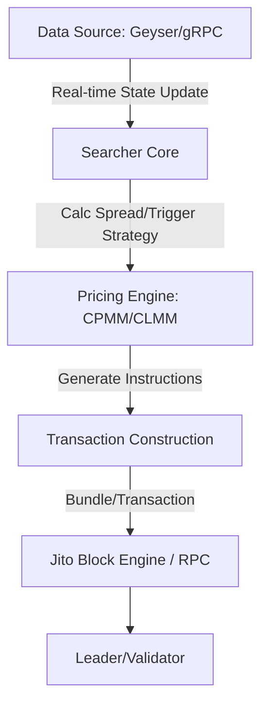
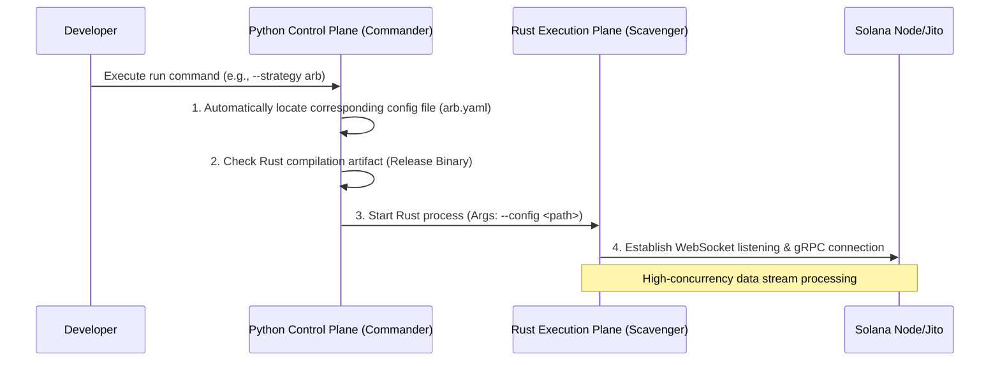
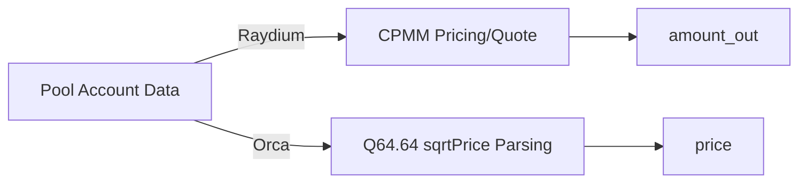
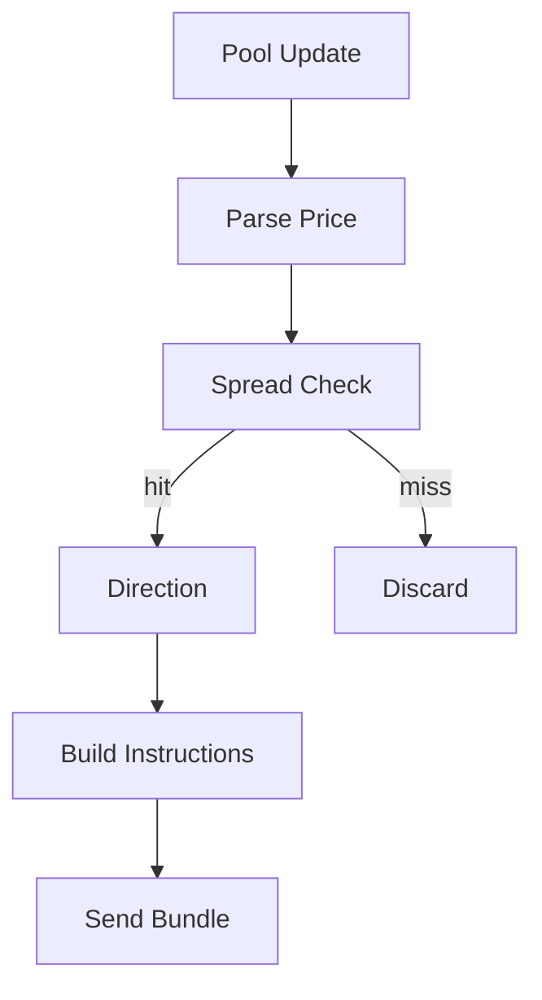
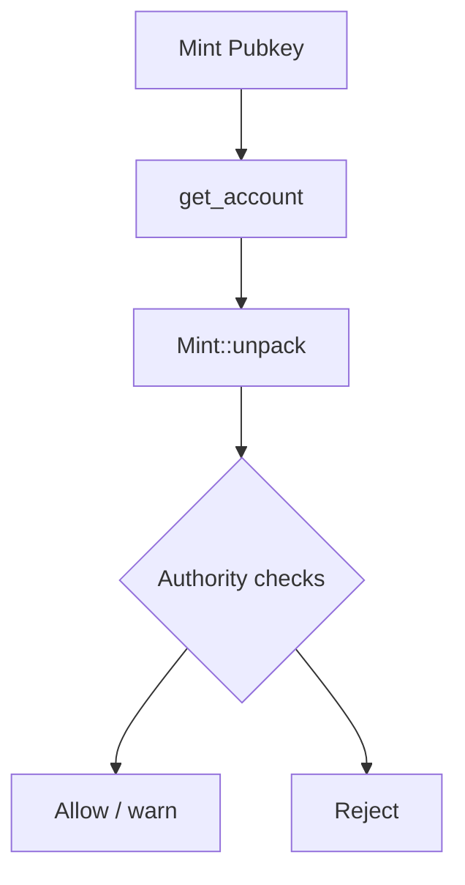

This is a consolidated, eight-part deep dive into building a **Solana MEV searcher** — from the "Dark Forest" laws of the chain down to a working architecture. It walks through the control plane, the network-wide inventory, sub-millisecond monitoring (scout), AMM pricing models, the cross-DEX arbitrage strategy, Jito bundles, and risk control. Each part below began as a standalone article; they're collected here as a single guide.


---

## Deep Dive into Solana MEV: "Dark Forest" Laws and Architectural Implementation Under High-Concurrency Engines

In the world of cryptocurrency, MEV (Maximal Extractable Value) is often likened to the "Dark Forest" of blockchain. With the explosion of the Solana ecosystem, this forest has become increasingly deep and complex. Compared to Ethereum's mature PBS (Proposer-Builder Separation) model, Solana, with its unique parallel execution, extremely high throughput, and slot time of less than 400ms, provides a completely different set of game rules for MEV explorers (Searchers).

As the opening piece of the **Solana MEV Deep Exploration Series**, this article will break down the underlying logic of Solana MEV from four dimensions: core concepts, transaction pipeline, technical architecture, and engineering implementation.

---

### 1. Redefining MEV: Gaming in the Context of Solana

#### 1.1 What is MEV?
MEV refers to the additional value that block producers (called Leaders in Solana) can obtain by **including, excluding, or reordering** transactions within the blocks they produce.

In Solana's high-performance environment, MEV is not just about "front-running", it embodies more of an **extreme latency competition and capital efficiency game**:

*   **Front-running:** Executing before a target transaction.
*   **Sandwich Attack:** Inserting buy and sell orders before and after a transaction with loose slippage control.
*   **Back-running:** Following up immediately with arbitrage execution after a large trade causes price impact.
*   **Spatial Arbitrage:** Capturing price differences between different liquidity pools like Raydium, Orca, Meteora, etc.
*   **Liquidation:** Snatching liquidation rewards the moment a lending protocol triggers liquidation due to price fluctuations.

#### 1.2 "Significant Differences" Between Solana and Ethereum
Solana's mechanism determines that it does not have the "classic public Mempool" of Ethereum.

1.  **No Global Public Mempool:** Transactions are sent directly to the Leader via QUIC protocol. It is difficult for ordinary users to execute sandwich attacks precisely by observing the Mempool as on Ethereum.
2.  **Deterministic Scheduling:** Solana uses the parallel processing engine Sealevel. If two transactions involve non-overlapping accounts, they will be executed in parallel, weakening the significance of ordering in a parallel environment.
3.  **Extremely Low Latency:** The 400ms block time requires Searcher's strategy logic to be completed within milliseconds: Sense State -> Calculate Spread -> Construct Transaction -> Send.

---

### 2. Overview of Solana Transaction Pipeline: Insertion Points for MEV

To capture MEV, one must understand how a transaction "flows" in the Solana network:

1.  **Transaction Construction:** The client specifies Instructions, account mappings, and signatures.
2.  **TPU Reception:** The transaction reaches the current Leader (TPU unit) via QUIC protocol.
3.  **Pipeline Ordering:** The Leader orders transactions within its Slot. At this point, **Priority Fee** and **Jito Tip** are key to determining the order.
4.  **Banking Stage:** Execute transactions, modify account states.
5.  **Final Confirmation:** Go through three confirmation stages (Processed -> Confirmed -> Finalized).

**Key Points for MEV Capture:**
*   **Perception Speed:** The faster you get Account Updates, the earlier you can discover opportunities.
*   **Inclusion Determinism:** How to ensure your arbitrage transaction is not discarded? This gave birth to third-party Bundle mechanisms like Jito.

---

### 3. Technical Framework: Core Components of a Searcher

In engineering implementation, a mature Solana MEV system usually includes the following modules:



*   **State Feed (State Perception):** Deprecating traditional WebSocket `logsSubscribe`, high-performance systems typically connect to **Geyser Plugins** or gRPC streams to obtain microsecond-level account change pushes.
*   **Searcher (Strategy Brain):** Responsible for parsing data streams, identifying pool changes, and executing risk control models.
*   **Block Engine (Inclusion Mechanism):** Similar to Flashbots on Ethereum. On Solana, **Jito-Solana** is mainstream, allowing Searchers to pack multiple transactions into a **Bundle** and pay Tips to Validators, ensuring atomic execution (all succeed or all fail).

---

### 4. Engineering Implementation: Layered Architecture Design

To balance development efficiency and execution performance, mainstream architectures tend to adopt a **"Control Plane + Data Plane"** layered design.

#### 4.1 Layered Logic
*   **Control Plane:** Usually written in **Python** or Go. Responsible for high-level logic, strategy scheduling, configuration file management, API interaction, and monitoring dashboards.
*   **Data Plane:** Must use **Rust**. Responsible for extremely fast data parsing (such as parsing complex Raydium/Orca states), local pricing calculation, signature construction, and Jito-based transaction sending.

#### 4.2 Core Algorithm: Inventory-Driven Monitoring
Blindly listening to all pools on the network leads to severe network congestion and computational waste. Efficient systems will:
1.  **Cold Start Scan:** Fetch all liquidity pools from Raydium and Orca APIs, filtering out potential arbitrage pairs based on asset quality and TVL.
2.  **Whitelist Generation:** Only subscribe to the screened pool accounts.
3.  **Local State Mirror:** Maintain a lightweight mirror of these pools (Reserves, SqrtPrice, etc.) in memory, without frequent RPC requests.

---

### 5. Core Code Logic Demonstration (Pseudocode)

#### 5.1 Cross-Protocol Pricing Difference Calculation
Pricing logic varies by protocol. For example, Raydium's CPMM vs. Orca's CLMM:

```python
# Constant Product Market Maker (CPMM) Simulation Output Calculation
def calculate_cpmm_out(amount_in, res_in, res_out, fee_rate=0.0025):
    amount_with_fee = amount_in * (1 - fee_rate)
    return (amount_with_fee * res_out) / (res_in + amount_with_fee)

# Concentrated Liquidity (CLMM) Price Parsing (Q64.64 Format)
def sqrt_price_x64_to_price(sqrt_price_x64):
    price = (sqrt_price_x64 / (2**64)) ** 2
    return price
```

#### 5.2 Monitoring and Trigger Logic
In the Rust Data Plane, the system listens for specific account changes:

```rust
// Pseudocode: Core processing flow after hearing account update
match account_update {
    RaydiumUpdate(data) => {
        let new_price = parse_raydium_reserves(data);
        inventory.update_price("SOL/USDC", Protocol::Raydium, new_price);
        check_arbitrage_opportunity("SOL/USDC");
    },
    OrcaUpdate(data) => {
        let new_price = parse_orca_sqrt_price(data);
        inventory.update_price("SOL/USDC", Protocol::Orca, new_price);
        check_arbitrage_opportunity("SOL/USDC");
    }
}
```

---

### 6. Summary: Future High Ground of Competition

Solana MEV has evolved from early "simple scripting" to an "all-around engineering race":
1.  **Network Optimization:** Whose server is closer to the Leader, whose QUIC connection configuration is better.
2.  **Algorithm Precision:** Instantaneous pricing precision for complex CLMM (Concentrated Liquidity) pools.
3.  **Capital Efficiency:** Ability to find the optimal path among multiple paths and combine Jito Bundles to avoid fee losses caused by failed transactions.

In the upcoming series of articles, we will delve into **How to Build a Network-Wide Token Index (Inventory)**, **How to Optimize gRPC Data Parsing Speed**, and **Jito Bundle Atomic Combat**.

Welcome to the Dark Forest of Solana, may your Bundles always be included.

---

## The "Brain" of the Strategy Engine: Architectural Practice of Decoupling Control Plane and Execution Plane

When building a Solana MEV system, developers often face a classic trade-off: **Rust's Speed** vs. **Python's Flexibility**.

To be able to burst like a cheetah (execution performance) while switching strategies flexibly like a fox (scheduling flexibility) in the "Dark Forest", we adopted a **Two-Tier Architecture Design**: a **Control Plane** built with Python responsible for strategy orchestration and configuration management, and a **Data Plane (Execution Plane)** built with Rust responsible for high-concurrency data processing.

This article will break down the logic behind this architecture and how to implement an industrial-grade strategy scheduling engine using Python.

---

### 1. Why Do We Need a "Control Plane"?

If we compare an MEV bot to a race car, the Rust execution engine is the V12 engine capable of withstanding high RPMs, while the Python control plane is the dashboard and gear stick in the cockpit.

#### 1.1 Decoupling Configuration and Logic

MEV strategies (such as arbitrage, sniping, liquidation) involve a large number of parameters: RPC node addresses, Jito Tip limits, whitelist tokens, maximum slippage controls, etc.

*   **Pain Point:** If these configurations are hardcoded in Rust, every fine-tuning of parameters requires recompilation. In a rapidly changing market, tens of seconds of compilation time are enough to let opportunities slip away.
*   **Solution:** Python is responsible for reading YAML/JSON configurations, preprocessing logic, and injecting them into the Rust process as command-line arguments or environment variables.

#### 1.2 Unified Entry and Multi-Strategy Management

A mature system often runs multiple strategies simultaneously.

*   **Arb (Arbitrage):** Long-running, monitoring mainstream pools.
*   **Sniper:** Started temporarily, targeting newly issued tokens.
*   **Control Plane:** Acts as a unified scheduler (Commander) that can launch different strategy instances with one click based on market conditions, realizing "Strategy as a Plugin".

---

### 2. Architecture Overview: Cross-Language Boundaries and Interfaces

The core interaction of the system follows the principle of **"Unidirectional Derivation, Process Isolation"**:



*   **Control Plane Responsibilities:** Environment check, automatic path derivation, process lifecycle management, Graceful Shutdown.
*   **Execution Plane Responsibilities:** Account state parsing, local pricing calculation, transaction construction, Bundle submission.

---

### 3. Technical Implementation Details

#### 3.1 Path Adaptation and Compilation Fallback

In a production environment, we run pre-compiled Rust Release binaries directly for the fastest startup speed. However, during the development and debugging phase, we want it to detect automatically.

**Scheduling Logic Pseudocode:**
1.  Check if binary exists under `target/release/`.
2.  If it exists, run directly via `subprocess.spawn`.
3.  If not, fallback to `cargo run --release`.

#### 3.2 Environment Isolation and Working Directory Constraints

MEV bots usually need to read local wallets (Keypairs) and cache files. To ensure security and consistency, the control plane must strictly constrain the **Current Working Directory (CWD)** of the Rust process. This effectively prevents path drift in different environments (Docker vs. Physical Machine).

---

### 4. Industrial-Grade Scheduler Code Example

Below is a simplified Python control plane implementation example. It demonstrates how to manage subprocesses and dynamically inject configurations.

```python
import argparse
import os
import subprocess
import sys
from pathlib import Path

class BotCommander:
    def __init__(self, strategy: str, config_name: str):
        self.strategy = strategy
        self.config_path = Path(f"configs/{config_name}.yaml").absolute()
        self.root_dir = Path(__file__).parent.parent  # Project root directory
        self.engine_dir = self.root_dir / "engine_rust" # Rust source directory

    def _find_binary(self) -> list:
        """Select execution command: prioritize release binary, otherwise fallback to cargo run"""
        release_bin = self.engine_dir / "target" / "release" / "mev_engine"
        
        if release_bin.exists():
            print(f"[*] Using pre-compiled binary: {release_bin}")
            return [str(release_bin)]
        
        print("[!] Release binary not found, attempting to start via cargo run...")
        return ["cargo", "run", "--release", "--bin", "mev_engine", "--"]

    def run(self):
        # Assemble full execution command
        base_cmd = self._find_binary()
        args = [
            "--strategy", self.strategy,
            "--config", str(self.config_path)
        ]
        full_cmd = base_cmd + args

        print(f"[*] Starting strategy [{self.strategy}]...")
        try:
            # Start execution plane using subprocess and lock working directory
            subprocess.run(full_cmd, cwd=self.engine_dir, check=True)
        except KeyboardInterrupt:
            print("\n[!] Stop signal received, shutting down bot...")
        except subprocess.CalledProcessError as e:
            print(f"[X] Execution engine crashed, exit code: {e.returncode}")

if __name__ == "__main__":
    parser = argparse.ArgumentParser(description="Solana MEV Control Plane")
    parser.add_argument("--strategy", default="arbitrage", help="Select strategy to run")
    parser.add_argument("--config", default="mainnet_alpha", help="Config file name")
    
    cmd_args = parser.parse_args()
    commander = BotCommander(cmd_args.strategy, cmd_args.config)
    commander.run()
```

---

### 5. Performance Optimization and DevOps Thoughts

In actual production, the design of the control plane also needs to consider the following points:

1.  **Warm-up:** Before officially starting arbitrage monitoring, the control plane can run a simple Python script to check RPC node latency and wallet balance, ensuring "nothing goes wrong" before passing the baton to Rust.
2.  **Log Triage:** The Rust side outputs structured JSON logs, and the Python side is responsible for collecting and pushing them to remote monitoring (such as Loki or Telegram Bot).
3.  **Hot Update Strategy:** For "blacklist tokens" that do not require code logic modification, file watcher mechanisms can be used. When Python modifies the configuration file, the Rust side reloads in real-time via the `notify` library without restarting the process.

---

## Efficient Reconnaissance: "Inventory-Driven Monitoring" in Solana MEV and Network-Wide Index Construction

On the Solana track, where thousands of transactions are generated every second, if you try to listen to all account updates across the entire network, your bot will quickly be drowned in massive data noise. RPC node bandwidth limits, CPU parsing pressure, and network latency will instantly destroy arbitrage opportunities.

Efficient Searchers never "listen blindly". They use a strategy called **"Inventory-Driven Monitoring"**: first building a global index of network-wide liquidity pools offline, filtering out high-value "arbitrage candidate pools", and then subscribing precisely.

This article will break down how to build this high-performance Inventory system.

---

### 1. Core Concept: Shrinking the Battlefield, Locking onto Winning Points

#### 1.1 Why Build an Inventory?
DEXs (Decentralized Exchanges) on Solana, such as Raydium and Orca, have tens of thousands of liquidity pools. But for arbitrage strategies, only those trading pairs that **exist simultaneously in multiple protocols** (e.g., SOL/USDC has a pool in Raydium and also in Orca) have atomic arbitrage space.

The tasks of the Inventory are:
*   **Cold Start Aggregation:** Fetch full pool lists from various DEX APIs.
*   **Intersection Calculation:** Find overlapping Token trading pairs.
*   **Whitelist Filtering:** Eliminate zombie pools and low liquidity pools, generating a "monitoring whitelist".

#### 1.2 Inventory-Driven vs. Full-Volume Driven
*   **Full-Volume Driven:** Subscribe to all logs, check tables upon discovering opportunities. The advantage is broad coverage, but the disadvantage is extremely high latency and processing of redundant data.
*   **Inventory-Driven:** Only subscribe to account updates within the whitelist. The advantage is extremely fast response and saving RPC resources, making it the top choice for high-frequency arbitrage.

---

### 2. Technical Architecture: High-Concurrency State Machine Supported by Rust

In the Rust execution engine, the Inventory module is designed as a **high-concurrency, thread-safe** singleton shared by multiple strategy modules.

#### 2.1 Key Data Structures: DashMap and Arc
Since data processing on Solana is multi-threaded and parallel, Inventory must handle extremely high read/write frequencies:

*   **DashMap:** A high-performance concurrent hash map. Compared to standard `HashMap + Mutex`, it refines locking granularity to the Shard level, avoiding global lock contention during high-frequency state parsing.
*   **Arc (Atomic Reference Counted):** Used to safely share the memory address of Inventory between different Tokio tasks (such as monitoring tasks, pricing tasks, execution tasks), achieving zero-copy data access.

#### 2.2 Index Layering Logic
The system internally maintains two layers of indexes:
1.  **Global Pool Index:** Maps pool addresses to token metadata (Mint, Decimals, Vault).
2.  **Arbitrage Pair Map:** Records "candidate arbitrage pairs". For example, inputting the Mint address of SOL immediately returns its associated information in Raydium Pool A and Orca Pool B.

---

### 3. Algorithm Implementation: Fast Intersection in $O(N+M)$

The core of building an arbitrage whitelist is "finding intersections".

1.  **Scan Protocol A (Raydium):** Store all pools into a temporary hash table as `Token_A -> Pool_Address`.
2.  **Scan Protocol B (Orca):** Traverse its pool list. If the same `Token_A` is found in Protocol A's hash table, a potential arbitrage opportunity is hit.
3.  **Generate Watchlist:** Add both hit pool addresses to the "Watchlist" simultaneously.

**Time Complexity:** Only two linear scans are needed. Even with tens of thousands of pools, cold start can be completed within milliseconds.

---

### 4. Performance Optimization Points: Speed from Engineering Details

#### 4.1 API Caching and Fault Tolerance
Official APIs of protocols like Raydium are often unstable. We added **local persistent caching** in the engineering implementation.
*   Prioritize reading local `pools_cache.json` during cold start.
*   Asynchronously request API updates for caching in the background.
*   This ensures that the bot can recover work immediately even in extreme network conditions.

#### 4.2 Subscription Limits and Sharding
Most RPC nodes have limits on the number of `accountSubscribe` per single connection (e.g., 50-100).
Inventory automatically sorts the Watchlist based on "Pool Heat (Volume/TVL)", prioritizing subscription to the Top N pools with the greatest profit potential, or dispersing subscriptions to multiple RPC nodes through **load balancing**.

---

### 5. Algorithm Prototype Demonstration (Python Logic Implementation)

Although we use Rust in the production environment, its underlying logic can be clearly expressed through the following Python example:

```python
from dataclasses import dataclass
from typing import Dict, List, Set

@dataclass(frozen=True)
class PoolMetadata:
    address: str
    token_mint: str

def build_arbitrage_radar(ray_pools: List[PoolMetadata], orca_pools: List[PoolMetadata]):
    # 1. Build Raydium Index (Token -> Pool)
    ray_index = {p.token_mint: p.address for p in ray_pools}
    
    arbitrage_watchlist = []
    
    # 2. Scan Orca for Intersections
    for o_pool in orca_pools:
        if o_pool.token_mint in ray_index:
            # Overlap found: This token has liquidity in both DEXs
            arbitrage_watchlist.append({
                "token": o_pool.token_mint,
                "raydium_pool": ray_index[o_pool.token_mint],
                "orca_pool": o_pool.address
            })
            
    return arbitrage_watchlist

# Mock Data Display
ray_list = [PoolMetadata("RAY_SOL_POOL", "SOL_MINT"), PoolMetadata("RAY_BONK_POOL", "BONK_MINT")]
orca_list = [PoolMetadata("ORCA_SOL_POOL", "SOL_MINT"), PoolMetadata("ORCA_WIF_POOL", "WIF_MINT")]

watchlist = build_arbitrage_radar(ray_list, orca_list)
print(f"[*] Found {len(watchlist)} potential arbitrage paths")
# Output will include the SOL path because both DEXs have SOL pools
```

---

### 6. Summary: Radar Activated

The Inventory module is the "filter" of the entire MEV system. It filters out network-wide noise, leaving only targets shining with profit potential.

*   **Without Inventory:** Your bot aimlessly processes thousands of invalid messages.
*   **With Inventory:** Your bot stares only at those dozens of high-frequency changing pools, ready to pull the trigger at any moment.

---

## Sub-millisecond Vision: Scout Monitoring and Extreme Parsing in Solana MEV

If the Inventory module is the bot's "memory", then the Scout module is its "eyes". In the turbulence of Solana generating tens of thousands of state changes per second, Scout's task is to filter, filter again, and decode signals that are truly meaningful for arbitrage strategies at extreme speeds.

In the world of MEV, **speed isn't everything, but without speed, there is nothing**. This article will delve into how to build a low-latency, high-concurrency transaction monitoring and parsing system.

---

### 1. Monitoring Philosophy: Scalpel vs. Dragnet

On Solana, we typically face two distinct monitoring needs, corresponding to different technical paths:

#### 1.1 `accountSubscribe`: The Precise Scalpel (Arb Mode)
For cross-protocol arbitrage (Arbitrage), we have already locked onto specific pools through Inventory. At this point, we don't need to observe the entire network, we just need to stare at the changes in the **Data field** of these pool accounts.
*   **Mechanism:** Once the token balance or price in the pool changes, the RPC node will immediately push the latest account data.
*   **Advantage:** The signal is extremely direct, skipping tedious transaction parsing, making it the fastest path for high-frequency arbitrage.

#### 1.2 `logsSubscribe`: The Network-Wide Dragnet (Sniper Mode)
For sniping new pools (Sniping), we cannot foresee the pool address, so we can only capture signals of "new pool creation" or "initial liquidity injection" instructions by listening to **Program Logs** of specific protocols (such as Raydium or Orca).
*   **Mechanism:** Scan for specific keywords (like `initialize2`) in logs.
*   **Challenge:** The noise is huge, and after a hit, a "slow path" process (such as requesting `getTransaction`) is usually needed to supplement the parsing of pool token information.

---

### 2. Core Architecture: Stream Multiplexing

In a mature system, you may need to subscribe to updates for hundreds of pools simultaneously. If you open a thread for each subscription, system overhead will explode instantly.

#### 2.1 Asynchronous Stream Merging (Select All)
We use Rust's asynchronous ecosystem (Tokio + Futures), utilizing `select_all` to merge hundreds or thousands of WebSocket subscription streams into a single event stream. This is like aggregating feeds from hundreds of surveillance cameras onto a single video wall, uniformly distributed and processed by a core loop (Event Loop).

#### 2.2 Thread Model and "Slow Path" Detachment
The response speed of the monitoring main loop determines the system's latency upper limit.
*   **Fast Path (Hot Path):** Receive data -> Memory decode -> Trigger calculation.
*   **Slow Path (Long Path):** If extra RPC requests are needed to complete information (like in Sniper mode), use `tokio::spawn` to immediately detach it to a background task execution, strictly prohibiting blocking the monitoring main loop.

---

### 3. Extreme Parsing: Skipping Useless Information

Solana's Account Data is usually a binary Buffer. An inefficient approach is to deserialize it into a complete object, while the extreme approach is **"On-Demand Parsing"**.

#### 3.1 Zero-Copy and Offset Positioning
For example, when monitoring Orca Whirlpool, we might only need `sqrt_price` and `tick_current_index`.
*   We don't need to parse the entire pool state (hundreds of bytes), just directly read the 16 bytes at a specific Offset in the data stream.
*   In Rust, by cooperating with `bytemuck` or simple pointer offsets, key pricing parameter extraction can be completed in microseconds.

#### 3.2 The Art of Filters
In the `logsSubscribe` stage, utilizing the `mentions` filter provided by RPC can filter out 90% of irrelevant logs on the node side, greatly reducing network IO pressure on the Searcher end.

---

### 4. Performance Optimization Points: Milliseconds from Engineering Implementation

1.  **Sharding:** Addressing connection limits of public RPC nodes, Scout automatically shards whitelist pools, receiving concurrently via multiple WebSocket connections to avoid Backpressure on a single connection.
2.  **Noise Reduction Mechanism:** For high-frequency changing pools, implement simple packet loss or coalescing logic. If multiple updates occur for the same pool within 1ms, only process the last state to save computing resources in the strategy layer.
3.  **Pre-reading Index:** When parsing logs, pre-load Decimals information of common tokens to avoid secondary requests when calculating spreads.

---

### 5. Technical Demo: Multi-Stream Event Merging Logic (Python Simulation)

Although the high-performance core is in Rust, its "many-to-one" merging and distribution logic can be perfectly expressed using asyncio:

```python
import asyncio
import random

async def pool_monitor(pool_id: str):
    """Simulate a subscription stream for an independent account"""
    while True:
        await asyncio.sleep(random.uniform(0.01, 0.1)) # Simulate random push
        yield {"pool": pool_id, "data": random.random()}

async def main_scout_loop():
    # Simulate monitoring list obtained from Inventory
    watchlist = ["Pool_A", "Pool_B", "Pool_C"]
    
    # Aggregate all streams into a queue
    queue = asyncio.Queue()

    async def producer(pool_id):
        async for update in pool_monitor(pool_id):
            await queue.put(update)

    # Start all producer tasks
    for p in watchlist:
        asyncio.create_task(producer(p))

    print("[*] Scout engine started, listening to multi-channel signals...")
    
    # Core consumption loop: Strategy distribution processing
    while True:
        event = await queue.get()
        # Immediately trigger asynchronous calculation in strategy layer
        asyncio.create_task(execute_strategy(event))

async def execute_strategy(event):
    print(f"⚡️ Signal captured: {event['pool']} -> Triggering pricing model calculation")

if __name__ == "__main__":
    asyncio.run(main_scout_loop())
```

---

### 6. Summary: The Sharpest Radar

The design level of the Scout module directly determines the bot's "starting speed". An excellent Scout should be:
*   **Broad enough:** Capable of capturing new opportunities via logs.
*   **Accurate enough:** Capable of locking onto price fluctuations via account subscriptions.
*   **Fast enough:** Adopting asynchronous architecture and binary parsing to suppress latency to the microsecond level.

---

## AMM: Pricing and Mathematical Models

This project aims to perform "pricing" locally as much as possible: even with only the raw data of pool accounts, it can quickly calculate prices/quotes locally, reducing reliance on RPC simulations and lowering latency.

### 1. Module Functionality Overview

- **CPMM (Raydium):** Constant Product pricing and quote calculation (`x*y=k`).
- **CLMM (Orca Whirlpool):** Deriving price from `sqrt_price(Q64.64)` and supporting tick/liquidity field reading (currently only for price reading; full swap requires tick arrays).
- **Quote:** Calculating `amount_out` locally by fetching necessary account data (AMM state + vault balance) via RPC.

Corresponding Source Code:

- CPMM: `../../scavenger/src/amm/math.rs`
- Raydium AMM State: `../../scavenger/src/amm/raydium_v4.rs`
- Orca Whirlpool Price Parsing: `../../scavenger/src/amm/orca_whirlpool.rs`
- Raydium Quote: `../../scavenger/src/core/quote.rs`



### 2. Technical Implementation Details

#### 2.1 Raydium (CPMM) Core

Common integer formulas for CPMM (including fees):

- `amount_in_with_fee = amount_in * (fee_den - fee_num)`
- `amount_out = (amount_in_with_fee * reserve_out) / (reserve_in * fee_den + amount_in_with_fee)`

This project uses `U256` to avoid u128 overflow, see `amm/math.rs`.

#### 2.2 Orca Whirlpool (CLMM) Core

Orca Whirlpool's `sqrt_price` is represented in Q64.64 (fixed-point number):

- `price = (sqrt_price / 2^64)^2`

To avoid defining the full Whirlpool account structure (which involves large fields and reward infos), this project uses an "offset slicing" approach to read key fields from account data:

- liquidity: `data[49..65]`
- sqrt_price: `data[65..81]`
- tick: `data[81..85]`

See `decode_current_price` in `amm/orca_whirlpool.rs`.

### 3. Key Algorithms and Data Structures

- **High-Precision Integers:** `U256` (generated by Rust `uint` macro)
- **Local Quoting:** `core/quote.rs` calls `amm/math.rs` after fetching vault balances.

### 4. Performance Optimization Points

- **Local Pricing First:** Calculate prices directly using account data to avoid heavy RPC calls like `simulateTransaction`.
- **Caching and Batch Reading (Future Improvements):**
  - Short TTL caching for frequently used vault balances.
  - Batch RPC (`getMultipleAccounts`) for multiple quotes within the same slot.

### 5. Runnable Example (CPMM Quote + Q64.64 Price Conversion)

```python
def get_amount_out(amount_in: int, reserve_in: int, reserve_out: int, fee_num: int, fee_den: int) -> int:
    # CPMM (with fee) integer implementation: suitable for quick quotes/estimations
    amount_in_with_fee = amount_in * (fee_den - fee_num)
    numerator = amount_in_with_fee * reserve_out
    denominator = reserve_in * fee_den + amount_in_with_fee
    return numerator // denominator

def sqrt_price_x64_to_price(sqrt_price_x64: int) -> float:
    # Orca Whirlpool: price = (sqrt_price / 2^64)^2
    q64 = float(1 << 64)
    p = float(sqrt_price_x64) / q64
    return p * p

def demo():
    out = get_amount_out(amount_in=100, reserve_in=1000, reserve_out=1000, fee_num=25, fee_den=10000)
    print("cpmm amount_out:", out)
    print("price(sqrt=2^64):", sqrt_price_x64_to_price(1 << 64))

if __name__ == "__main__":
    demo()
```

---

## Strategy: Cross-DEX Arbitrage Strategy (arb)

The arb strategy is embodied in this project as a closed loop of "Discover Spread → Decide Direction → Construct Atomic Transaction → Send Bundle". The current implementation uses "Price Difference between Raydium vs Orca" as the trigger condition, and constructs a Raydium swap + tip bundle when an opportunity is found (Orca swap construction currently lacks tick array dependency, which is a to-do item).

### 1. Module Functionality Overview

- Receive pool account updates (Raydium or Orca).
- Parse Price:
  - Orca: Calculate price directly from `sqrt_price`.
  - Raydium: Read cached fields from AMM state and calculate price (or read vault balance via quote module for more realistic quoting).
- Calculate Spread: Trigger when spread exceeds threshold.
- Generate Transaction Instructions: Construct swap instruction, append tip instruction.
- Send Execution: Serialize transaction to base58, call Jito bundle interface to send.



Corresponding Source Code:

- `../../scavenger/src/strategies/arb.rs`

### 2. Technical Implementation Details

#### 2.1 Trigger and Direction

- Spread Calculation: `spread = abs(price_a - price_b) / min(price_a, price_b)`
- Direction Selection: Buy Low Sell High (If A < B, buy A sell B, otherwise vice versa)

#### 2.2 Instruction Construction and Limitations

Current Implementation:

- Raydium swap: Constructible (see `build_raydium_swap_ix` in `arb.rs`)
- Orca swap: Logic is clear but lacks account completion like tick array/oracle, temporarily returns directly (see warning in `arb.rs`)

Therefore, at this stage, the "real executable arbitrage closed loop" still needs to complete the account derivation and tick array selection logic for Orca swap.

### 3. Key Algorithms and Data Structures

- Spread determination and direction selection
- Atomic Transaction Instruction List: `Vec<Instruction>` (Swap first, then Tip)
- Transaction serialization and bundle payload (see execution module)

### 4. Performance Optimization Points

Key bottlenecks in arbitrage strategy performance are usually not in mathematical calculations, but in:

- Quoting Acquisition (RPC/Account Reading): Cache as much as possible or use accountSubscribe to get data directly.
- Account Derivation Required for Instruction Construction: Pre-calculation and caching (e.g., ATA, PDA, tick arrays).
- Transaction Inclusion Probability: Dynamic adjustment of tip/priority fee (refer to profit/tip model in `core/pricing.rs`).

### 5. Runnable Example (Spread Determination + Direction Selection + Tip Calculation)

The following example demonstrates a "runnable minimal arbitrage decider": inputs prices on both sides and configuration, outputs direction and tip (does not depend on Solana SDK).

```python
from dataclasses import dataclass
from typing import Optional, Tuple

@dataclass(frozen=True)
class ProfitConfig:
    min_profit_sol: float = 0.01
    max_tip_sol: float = 0.1
    gas_cost_sol: float = 0.000005
    dynamic_tip_ratio: float = 0.5

def decide_arbitrage(
    price_a: float,
    price_b: float,
    input_sol: float,
    cfg: ProfitConfig,
) -> Optional[Tuple[str, float]]:
    # Input: Prices on both sides and invested capital; Output: Direction and tip (if net profit threshold is met)
    if price_a <= 0 or price_b <= 0:
        return None

    buy_on = "A" if price_a < price_b else "B"
    sell_on = "B" if buy_on == "A" else "A"

    gross_profit = input_sol * (abs(price_a - price_b) / min(price_a, price_b))
    potential_tip = gross_profit * cfg.dynamic_tip_ratio
    tip = min(potential_tip, cfg.max_tip_sol)
    net_profit = gross_profit - cfg.gas_cost_sol - tip

    if net_profit >= cfg.min_profit_sol:
        return (f"buy {buy_on} -> sell {sell_on}", tip)
    return None

if __name__ == "__main__":
    cfg = ProfitConfig()
    decision = decide_arbitrage(price_a=1.00, price_b=1.02, input_sol=1.0, cfg=cfg)
    print("decision:", decision)
```

---

## The Final Step to Profit: Deep Dive into Jito and "MEV Yield Farming" on Solana

In the previous articles of this series, we discussed how to discover opportunities (Scout) and calculate profits (AMM). But in Solana's "Dark Forest", finding an opportunity is only half the battle; the other half is ensuring your transaction gets **included in a block before your competitors**.

This brings us to a pivotal infrastructure in the Solana ecosystem—**Jito**. It is not only a powerful tool for developers to capture MEV but also a "secret weapon" for ordinary users to obtain excess returns.

---

### 1. What is Jito? Solana's "Order Maker"

Before Jito, arbitrageurs on Solana mainly competed for ordering through "Spamming", which led to severe network congestion. Jito's emergence mimicked the idea of Flashbots on Ethereum, introducing the concept of **Proposer-Builder Separation (PBS)** to Solana.

#### 1.1 Three Core Components of Jito
1.  **Jito-Solana Client:** This is a modified version of the Solana validator software. Currently, about 80% of validators on the network run it.
2.  **Jito Block Engine:** This is an off-chain sealed auction house. Searchers pack transactions into a **Bundle** and submit it to the engine along with a **Tip**.
3.  **Bundle Mechanism:** Ensures that a group of transactions either all execute or none execute. This perfectly solves the risk of "broken legs" (one side executes while the other fails) in arbitrage.

---

### 2. Jito's Profit Loop: From Searchers to Token Holders

Jito has established an ingenious profit distribution chain, which is also the basis of its yield farming logic:

1.  **Searcher:** Discovers arbitrage opportunities, constructs Bundles, and pays **Tips** to Jito nodes.
2.  **Validator:** Runs Jito nodes, collects Tips, and distributes them to stakers.
3.  **JitoSOL (Liquid Staking Protocol):** Automatically selects high-quality validators running Jito nodes for staking and captures these MEV revenues.

---

### 3. Advanced: "MEV Yield Farming" Solutions Based on Jito

Ordinary users don't need to write code to run bots to share the MEV dividends through the following ways:

#### Solution A: Basic Yield — Holding JitoSOL (LST)
JitoSOL is the largest Liquid Staking Token (LST) on Solana. Compared to ordinary SOL staking, JitoSOL's yield composition is:
*   **Staking Rewards + MEV Tips Share.**
*   **Advantage:** Auto-compounding, yield is usually 1%-2% higher than native staking.

#### Solution B: Leveraged Yield — Looping
In lending protocols like **Kamino** or **Marginfi**:
1.  Deposit JitoSOL as collateral.
2.  Borrow SOL.
3.  Swap borrowed SOL back to JitoSOL and deposit again.
*   **Principle:** Through looping leverage, you are essentially longing the difference between "MEV yield and borrowing rate".

#### Solution C: Liquidity Mining (LPing)
Provide liquidity for the **JitoSOL/SOL** pair in Concentrated Liquidity Market Maker (CLMM) pools on **Orca** or **Raydium**.
*   **Advantage:** Since JitoSOL and SOL are highly correlated, there is almost no Impermanent Loss (IL), while earning trading fees + staking rewards + MEV share.

---

### 4. Developer Perspective: How to Send Transactions Using Jito?

For MEV developers, Jito provides gRPC and HTTP interfaces. A typical Bundle construction logic is as follows:

1.  **Construct Transaction Stream:** Contains your arbitrage instructions (e.g., Swap A -> Swap B).
2.  **Insert Tip Instruction:** In the last transaction of the Bundle, add a transfer instruction to transfer a certain amount of SOL to the **Tip Account** specified by Jito.
3.  **Submit Request:** Send the packed Bundle to the Block Engine.

**Note:** Jito ranks all received Bundles based on the Tip amount, and the highest bidder wins.

---

### 5. Summary: Democratization of MEV Revenue

Jito's success lies in making MEV revenue, which was originally a "black box", transparent and market-oriented.
*   For the **Network**, it reduces spam transactions and improves stability.
*   For **Developers**, it provides atomicity guarantees and deterministic ordering.
*   For **Ordinary Users**, through products like JitoSOL, it allows everyone to share the prey revenue in the "Dark Forest" with a low threshold.

In a Solana investment portfolio, understanding and making good use of Jito's yield engine is a necessary path for you to advance from an "Ordinary Player" to an "Advanced Player".

---

## Risk: Risk Control and Safety Checks

MEV strategy risks come not only from "price fluctuations" but also from "asset permissions and tradability". For example, if a new token has a Freeze Authority, it may cause assets to be unable to be transferred out, turning arbitrage/sniping directly into a capital black hole.

### 1. Module Functionality Overview

- **Security Checks on Target Token Mint:**
  - Whether Freeze Authority is None
  - Whether Mint Authority has been discarded (strict strategy may require it to be None)
  - Read supply/decimals as risk references



Corresponding Source Code:

- `../../scavenger/src/core/risk.rs`

### 2. Technical Implementation Details

Execution steps of `check_token_risk`:

1. RPC fetch mint account: `get_account(mint)`
2. Parse data using SPL Token's `Mint::unpack`
3. Judge risk based on authority fields and output `RiskReport`

Common extended checks in strategies include:

- Whether transfer is possible (transfer hook, blacklist mechanisms, etc.)
- Whether LP is locked, whether liquidity can be removed
- Whether the contract is upgradable (upgrade authority)
- Transaction tax/Anti-MEV mechanisms (some tokens deduct tax during transfer/swap)

### 3. Key Algorithms and Data Structures

- `RiskReport`: Unifies check results, facilitating the strategy layer to make "hard rejection/soft warning" decisions.

### 4. Performance Optimization Points

- **Caching:** Cache risk reports for the same mint (TTL e.g., 10~60 minutes) to avoid high-frequency repetitive RPC calls.
- **Batching:** Use `getMultipleAccounts` to batch fetch a group of mints.

### 5. Runnable Example (Minimal Risk Checker)

This example simulates mint permission check logic using pure Python data structures and can be run directly:

```python
from dataclasses import dataclass
from typing import List, Optional

@dataclass(frozen=True)
class MintMeta:
    mint_authority: Optional[str]
    freeze_authority: Optional[str]
    supply: int
    decimals: int

@dataclass(frozen=True)
class RiskReport:
    is_safe: bool
    reasons: List[str]

def check_mint_risk(m: MintMeta, strict: bool = False) -> RiskReport:
    # When strict=True, mint_authority is also treated as a hard risk
    reasons: List[str] = []
    safe = True
    if m.freeze_authority is not None:
        safe = False
        reasons.append("freeze_authority is set")
    if strict and m.mint_authority is not None:
        safe = False
        reasons.append("mint_authority is set (strict)")
    if m.decimals > 12:
        reasons.append("unusual decimals")
    return RiskReport(is_safe=safe, reasons=reasons)

if __name__ == "__main__":
    demo = MintMeta(mint_authority="AUTH", freeze_authority=None, supply=10_000_000, decimals=6)
    print(check_mint_risk(demo, strict=False))
    print(check_mint_risk(demo, strict=True))
```
